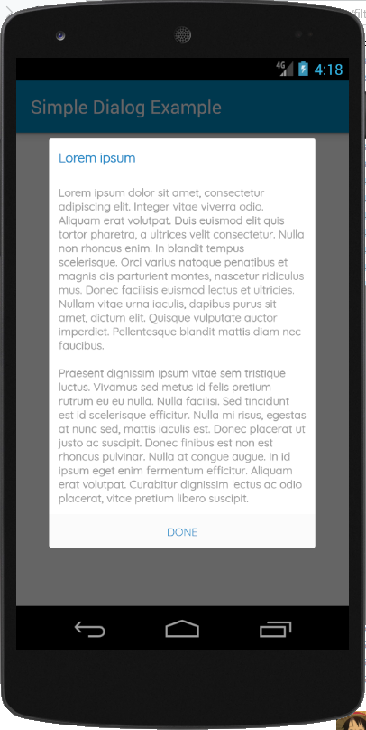

[](https://jitpack.io/#barisatalay/Simple-Dialog)

# Simple-Dialog
Simple Message Dialog for Android Projects

# Whos uses this library?
[Paximum](https://play.google.com/store/apps/details?id=com.santsg.paximum)

[Sejour Mobile](https://play.google.com/store/apps/details?id=com.santsg.sejourmobile)

[Tarım Simsari](https://play.google.com/store/apps/details?id=com.tarimsimsari.mobile)

[TourVisio 2 Mobile](https://play.google.com/store/apps/details?id=com.santsg.tv2m)

[Anime Takip](https://play.google.com/store/apps/details?id=com.atalay.animetakipall)

[Zoometri](https://play.google.com/store/apps/details?id=com.zoometri.mobile)

[TourVisio B2B](https://play.google.com/store/apps/details?id=com.santsg.tourvisiob2b)

## Screen Shots



## Usage

### Step 1
```groovy
allprojects {
		repositories {
			...
			maven { url 'https://jitpack.io' }
		}
	}
```

### Step 2

Add dependencies in build.gradle.
```groovy
    dependencies {
       implementation 'com.github.barisatalay:Simple-Dialog:1.0'
    }
```

### Step 3 (Use of library)
Create FilterDialog for Custom class;
```java
   val style = mdlStyle(
     titleColor = R.color.colorPrimary,
     messageColor = R.color.colorTextSoft,
     buttonColor = R.color.colorPrimary)

   SimpleDialog(this)
     .style(style)
     .show("Title","Description","Done")
``` 


## Contact me
 If you have a better idea or way on this project, please let me know, thanks :)

[Email](mailto:b.atalay07@hotmail.com)

[My Blog](http://brsatalay.blogspot.com.tr)

[My Linkedin](http://linkedin.com/in/barisatalay07/)
